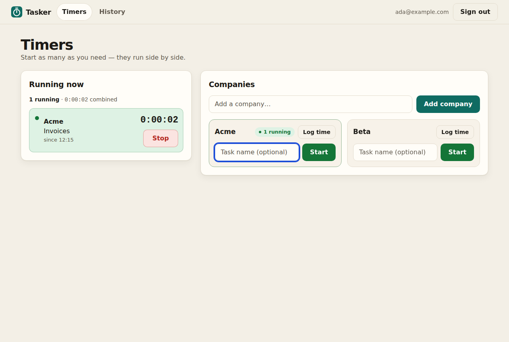
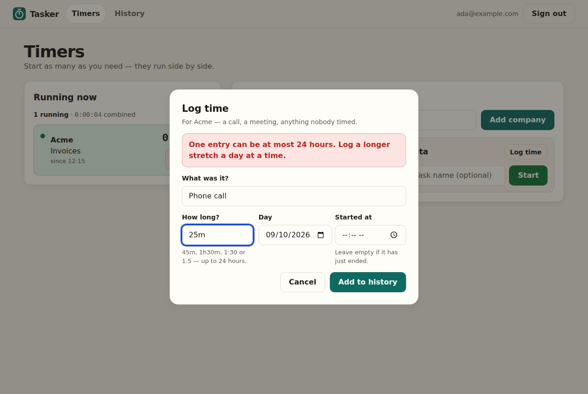
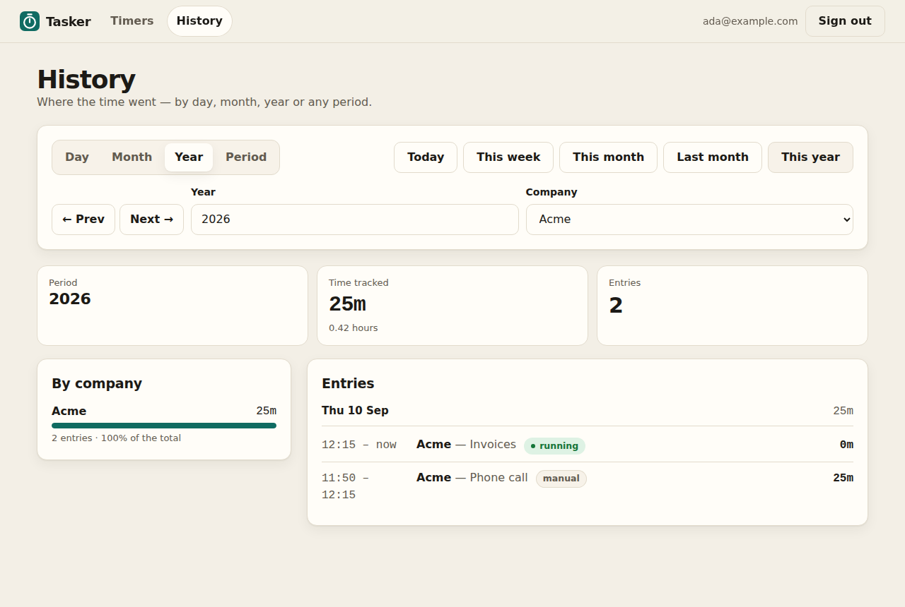
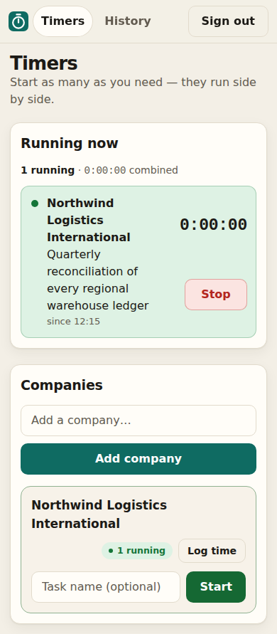
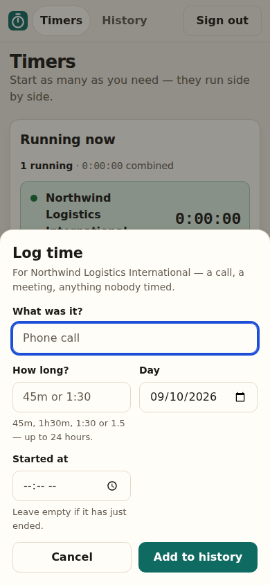
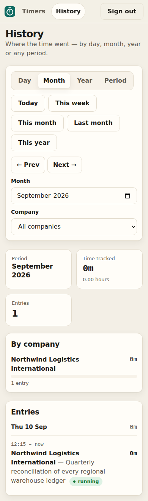
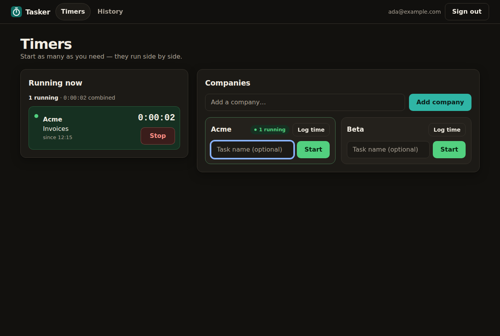

# Tasker

A small multi-user time tracker for people who work on several things at once.
Add the companies you work for, type what you are doing and press **Start** — then
start another, and another. Every running timer ticks live, a phone call nobody
timed can be logged afterwards, and the history shows where the time went by day,
month, year or any period.



## What it does

- **Accounts.** Register and sign in with an email address and a password. Each
  person sees only their own companies and time.
- **Parallel timers.** Every company card has a short task box and a Start button.
  The entry is written to the database the moment Start is pressed, and any number
  of timers can run at once, on one company or on several.
- **Live.** The running list counts up every second without a reload, and a timer
  started or stopped in another tab or on another device shows up by itself.
- **Log time by hand.** For the call or meeting nobody timed: what it was, how long
  (`45m`, `1h30m`, `1:30`, `1.5`), which day, and optionally when it started.
- **History.** Filter by day, month, year or a custom period, jump with presets
  (today, this week, this month, last month, this year) or step back and forward,
  and narrow it to one company. The filter lives in the address, so a view can be
  bookmarked and survives a reload.

| Log time by hand | History |
|---|---|
|  |  |

| On a phone | Logging time on a phone | History on a phone |
|---|---|---|
|  |  |  |

It follows the system's light or dark setting:



## Run it

### With Docker

```sh
cp .env.example .env          # optional — without it the port is 1222
docker compose up -d --build
```

Open <http://localhost:1222>. The port is `TASKER_PORT` in `.env`, and the same
port is used inside the container, so the address in the log is the one to open.
The database lives in the `tasker-data` volume and survives a rebuild.

### From source

Needs Go 1.26.

```sh
go run ./cmd/tasker           # http://localhost:8080, database in data/tasker.db
```

| Flag | Environment | Default | |
|---|---|---|---|
| `--addr` | `TASKER_ADDR` | `:8080` | Address to listen on. |
| `--db` | `TASKER_DB` | `data/tasker.db` | SQLite database file, created with its directory if missing. |
| `--secure-cookies` | `TASKER_SECURE_COOKIES` | `false` | Mark the session cookie Secure. |

Turn on secure cookies only when Tasker is reached over HTTPS. Over plain HTTP the
browser never sends a Secure cookie back, so signing in would appear to work and
the next page would be signed out again.

## Rules worth knowing

- **Days are the user's own.** Days, weeks and months follow the time zone the
  browser reported at registration. Times are stored in UTC.
- **Weeks start on Monday.**
- **A period counts only the time inside it.** Looking at one day, a timer that ran
  past midnight counts only the part it spent in that day.
- **Logged time** must already have happened and can be at most 24 hours per entry.
  Without a start time it is taken to have just ended, so any day other than today
  needs a start time. It is marked *manual* in the history.
- **The history lists the latest 500 entries** of a period. The totals always cover
  every entry.
- **Passwords** are 8 characters to 72 bytes, stored as bcrypt hashes.
- **Not built yet:** password reset, and editing or deleting an entry.

## How it is built

- **Go, one binary.** The stylesheet, icon and database migrations are embedded.
- **SQLite without cgo** — [modernc.org/sqlite](https://gitlab.com/cznic/sqlite), so
  `CGO_ENABLED=0` builds a static binary. WAL mode, one writer connection, and a
  separate read-only pool.
- **[Datastar](https://data-star.dev) on the page, [templ](https://templ.guide) on
  the server.** The server renders HTML and sends fragments over server-sent
  events; the browser holds nothing but what is being typed, and each action sends
  only the fields it needs.
- **CQRS, kept small.** A service per domain is the only writer and enforces the
  rules; pages read through narrow read-only interfaces. After a write, an
  in-process bus tells that user's open dashboards to re-read.
- **One stream per dashboard.** It re-renders the running timers each second and
  the companies when something changes, and reconnects by itself after a server
  restart. Shutdown ends open streams instead of waiting for them.
- **Sessions** are kept server-side in SQLite. Every write must carry Datastar's
  request header, which a page on another site cannot add.

## Develop

The generated `*_templ.go` files are committed, so building needs nothing beyond
Go. After changing a `.templ` file:

```sh
go install github.com/a-h/templ/cmd/templ@v0.3.1020
templ generate
go test ./...
```

`go test ./...` runs the domain against a real SQLite database, and the HTTP layer
through its real routes, sessions and migrations.

A browser walk drives the built binary in Chromium — at desktop size and on a
390 px phone — and checks what a person would notice: timers ticking, a second tab
staying in step, a restart with dashboards open, the log-time dialog, the history
filters, and what each action actually sends. It also takes the screenshots above.

```sh
CGO_ENABLED=0 go build -o tasker ./cmd/tasker
cd scripts/browser
npm ci && npx playwright install chromium
TASKER_BIN=../../tasker node walk.mjs
```

It starts its own server on a scratch database and prints `BROWSER_FAILURES=0`
when everything held.

## License

See [LICENSE](LICENSE).
